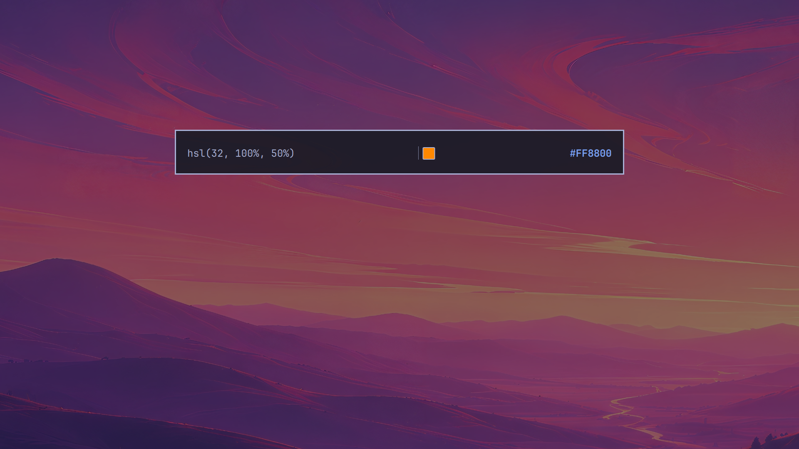
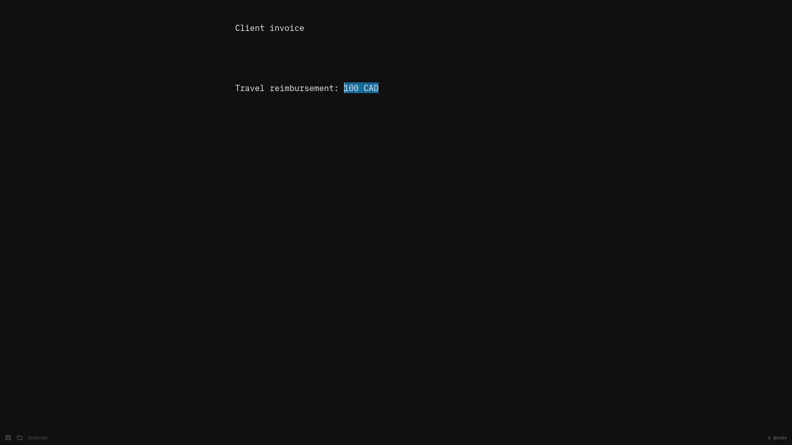
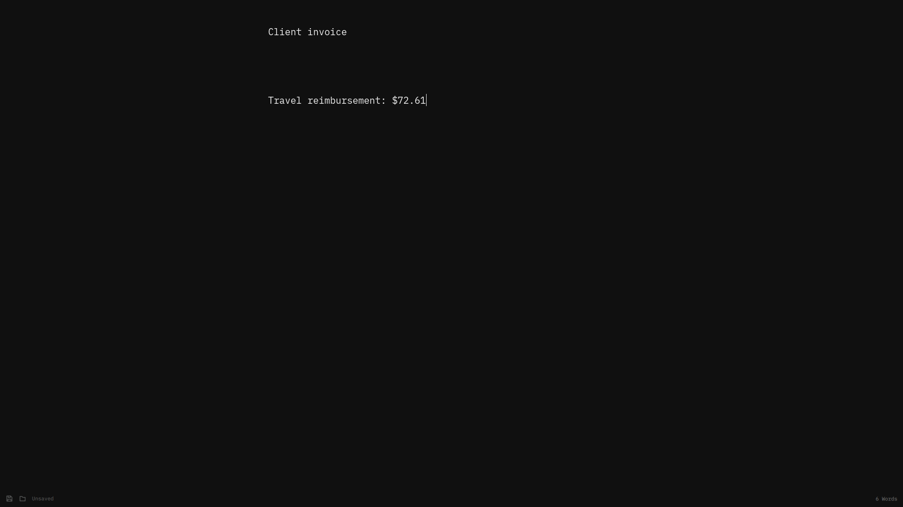
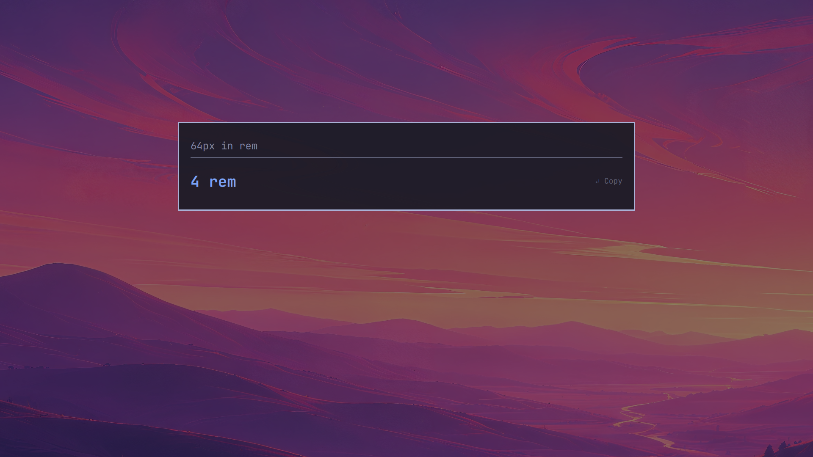
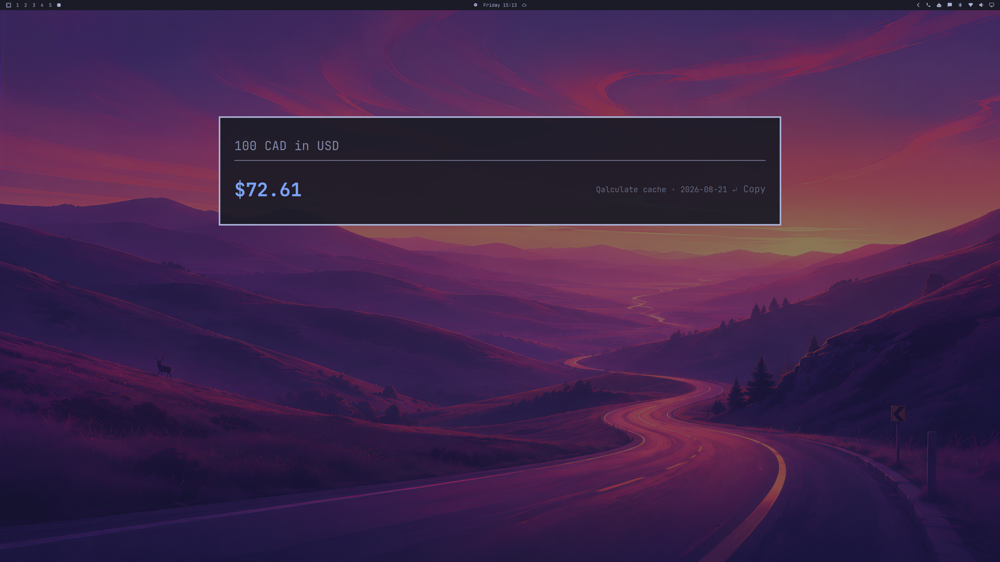
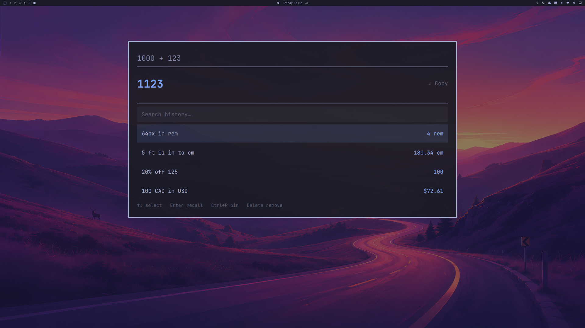

# OmaQuickCalc

<p align="center">
  <strong>Select it. Transform it. Put it straight back.</strong><br>
  A Raycast-style quick calculator built for Omarchy Quattro.
</p>



<p align="center">
  <a href="assets/omaquickcalc-demo.mp4"><strong>Watch Transform in Place</strong></a>
  ·
  <a href="#install"><strong>Install</strong></a>
  ·
  <a href="docs/CONFIGURATION.md"><strong>Configure</strong></a>
  ·
  <a href="SECURITY.md"><strong>Security</strong></a>
</p>

OmaQuickCalc is a fast expression and conversion palette for Omarchy. Launch it
for an instant answer, or select a value and transform it directly in the app
where you are working.

## Transform in Place

Highlight `100 CAD`, summon OmaQuickCalc, and type `in USD`. Press `Enter` to
copy `$72.61`, or `Shift+Enter` to replace the original selection.

**1. Select the value**



**2. Transform it and put the answer back**



Selection capture runs only from a shortcut you explicitly approve. Normal
launcher opens remain clipboard-blind. See [Security](SECURITY.md) for details.

## Examples

**Design units — `64px in rem` → `4 rem`**



**Mixed units — `5 ft 11 in to cm` → `180.34 cm`**


**Currency — `100 CAD in USD` → `$72.61` with rate context**



**Math and history — `1000 + 123` → `1123`**



Also try `20% off 125`, `square root of 625`, `18% tip on 80`, or
`1pm pacific` to convert directly to your local time.

## Install

OmaQuickCalc requires **Omarchy Quattro**. Install and enable it with the native
plugin command:

```bash
omarchy plugin add https://github.com/camerontucker/omaquickcalc.git --enable
```

The plugin checks for `python`, `libqalculate`, and `wl-clipboard`, then offers
to install anything missing in a visible terminal. To install them yourself:

```bash
omarchy pkg add python libqalculate wl-clipboard
```

Launch from `Super + Space`. On first use, choose whether to replace Omacalc's
shortcut, set another, or skip. Nothing changes without confirmation.

Omarchy plugins run as unsandboxed user code. Review the
[security notes](SECURITY.md) before enabling any community plugin.

## Configuration

Set history, precision, currencies, clock format, rate freshness, REM and
workday bases, and background transparency in
`~/.config/omaquickcalc/config.json`. See the
[configuration reference](docs/CONFIGURATION.md).

## Privacy and security

Calculations are local, with no account, telemetry, ads, or API key. Qalculate
may access the network only to refresh exchange rates. History can be
persistent, session-only, or disabled.

Transform selections are private, single-use, excluded from history, and
replaced only in the originating window. The plugin never overwrites unmarked
desktop or Hyprland configuration. Read the full [security model](SECURITY.md).

## Update

```bash
omarchy plugin update io.github.camerontucker.omaquickcalc
```

Omarchy shows the incoming update for review before applying it.

## Remove

Use the bundled removal script to remove the managed shortcut and launcher:

```bash
~/.config/omarchy/plugins/io.github.camerontucker.omaquickcalc/uninstall.sh --yes
```

Preferences and history are retained. To erase those too:

```bash
rm -rf ~/.config/omaquickcalc ~/.local/share/omaquickcalc
```

<details>
<summary>Development</summary>

From a source checkout, run `./install.sh`. Before a release:

```bash
PYTHONDONTWRITEBYTECODE=1 python3 -m unittest discover -s tests -v
bash -n install.sh uninstall.sh
omarchy plugin validate .
/usr/lib/qt6/bin/qmllint -I /usr/share/omarchy/shell OmaQuickCalc.qml
git diff --check
```

Architecture and contributor invariants live in [AGENTS.md](AGENTS.md).
Release history lives in [CHANGELOG.md](CHANGELOG.md).

</details>

## License

[MIT](LICENSE) © 2026 OmaQuickCalc contributors.
