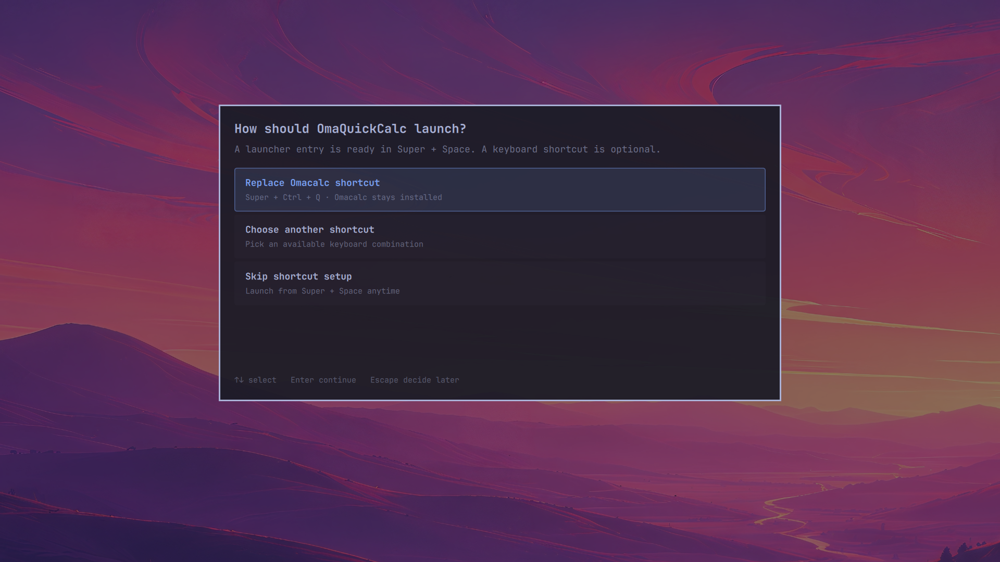

# OmaQuickCalc

<p align="center">
  <strong>One floating input. Instant answers.</strong><br>
  A Raycast-style quick calculator built for Omarchy Quattro.
</p>


<p align="center">
  <a href="assets/omaquickcalc-demo.mp4"><strong>Watch the quick demo</strong></a>
  ·
  <a href="#install"><strong>Install</strong></a>
  ·
  <a href="docs/CONFIGURATION.md"><strong>Configure</strong></a>
  ·
  <a href="SECURITY.md"><strong>Security</strong></a>
</p>

OmaQuickCalc turns a calculation into one short keyboard flow: launch, type,
press Enter, paste the result. There is no mode switch—the expression decides
whether you are doing arithmetic, converting currency, comparing timezones, or
translating a color.

It complements the official [Omacalc](https://github.com/omacom-io/omacalc).
Omacalc is a traditional standalone calculator with a keypad; OmaQuickCalc is a
keyboard-first expression and conversion palette inside `omarchy-shell`.

## Try asking

| Need | Type |
| --- | --- |
| Everyday math | `240 * 15%` or `square root of 625` |
| Discounts and tips | `20% off 125` or `18% tip on 80` |
| Units | `10ft in m` |
| Currency | `$2.5m in cad` or `500 quid to eur` |
| Timezones | `5pm ldn in sf` or `time in Tokyo` |
| Dates and durations | `March 4, 2030 + 45 days` or `90 mins to timespan` |
| Design values | `64px in rem` or `16 h in workdays` |
| Colors | `hsl(32, 100%, 50%)` |

The result updates while you type. Press Enter or click the result to copy the
answer and close; use `Ctrl+Enter` to copy without leaving the palette.

## Why it feels at home in Omarchy

- **Fast by default.** Live evaluation, result chaining, searchable history,
  and contextual actions stay inside one focused overlay.
- **More than arithmetic.** Qalculate powers units, constants, functions, and
  currencies; OmaQuickCalc adds natural phrases, dates, timezones, workdays,
  REM/PX, timespans, and color formats.
- **Built for the keyboard.** Copy the answer, copy the full equation, swap a
  conversion, pin history, refresh rates, or select fractions, bases, and
  scientific notation without reaching for another app.
- **Actually themed.** The palette follows the active Omarchy colors,
  typography, borders, spacing, and your chosen background transparency.
- **Careful with your desktop.** The launcher works after a normal marketplace
  install. Shortcut changes are optional, shown before writing, limited to one
  marked block, validated with Hyprland, and rolled back if rejected.

## Install

OmaQuickCalc requires **Omarchy Quattro**. Install and enable it with the native
plugin command:

```bash
omarchy plugin add https://github.com/camerontucker/omaquickcalc.git --enable
```

Normal marketplace installation does not execute `install.sh`, and
OmaQuickCalc does not depend on it. Once enabled, the overlay creates its owned
launcher entry on load. On first use it checks its three runtime dependencies:

- `python` runs the bundled evaluator and safe launch-setup helper.
- `libqalculate` provides `qalc`, the local calculation engine.
- `wl-clipboard` provides `wl-copy` for result copying.

If one is missing, pressing Enter on the dependency prompt opens Omarchy's
package command in a visible terminal for normal authentication. Nothing is
installed in the background. To install them yourself:

```bash
omarchy pkg add python libqalculate wl-clipboard
```

Omarchy plugins run as unsandboxed user code. Review the source and
[security notes](SECURITY.md) before enabling any community plugin.

## Launch and first run

Open the app launcher with `Super + Space`, search for **OmaQuickCalc**, and
press Enter. The first-run screen offers three choices:

1. Replace Omacalc's `Super + Ctrl + Q` binding.
2. Choose another shortcut after OmaQuickCalc checks for conflicts.
3. Skip shortcut setup and keep launching from `Super + Space`.



No shortcut is changed until you see the exact effect and confirm it. Replacing
the binding does not uninstall Omacalc; it remains available from the launcher.
Right-click OmaQuickCalc in a desktop-entry-aware launcher and select
**Configure launch shortcut** to revisit this screen.

You can also summon the palette directly, optionally with an expression:

```bash
omarchy-shell shell summon io.github.camerontucker.omaquickcalc '{}'
omarchy-shell shell summon io.github.camerontucker.omaquickcalc \
  '{"expression":"12 ft to m"}'
```

## Keyboard

| Key | Action |
| --- | --- |
| `Enter` | Run the configured default action: copy result and close initially |
| `Ctrl+Enter` | Copy the result and keep the palette open |
| `Shift+Enter` | Copy `expression = result` |
| `Tab` | Replace the expression with its result for chaining |
| `Alt+Enter` | Expand or collapse the full result or error |
| `Ctrl+K` | Open contextual result and format actions |
| `Up` or `Ctrl+H` | Open searchable calculation history |
| `Up` / `Down` | Move through history or actions |
| `Enter` in history | Recall the selected expression |
| `Ctrl+P` in history | Pin or unpin the selected entry |
| `Delete` in history | Remove the selected entry |
| `Ctrl+Shift+Delete` | Confirm and clear all history |
| `Escape` | Close a panel, clear the input, then close the palette |

Enter, `Ctrl+Enter`, and clicking the displayed result copy the evaluated
**result**. Copying the equation is always the separate `Shift+Enter` action.

## Configuration

OmaQuickCalc creates `~/.config/omaquickcalc/config.json`. Settings include
history privacy and retention, the default Enter action, decimal precision,
currency defaults, 12/24-hour clocks, rate freshness, REM and workday bases,
and `backgroundOpacity` from fully transparent (`0`) to opaque (`1`).

See the [configuration reference](docs/CONFIGURATION.md) for every field,
accepted value, and data location.

## Privacy and security

Calculations happen locally through the bundled Python evaluator and `qalc`.
OmaQuickCalc has no account, telemetry, advertising, or API key. Expressions
are passed as process arguments rather than interpolated into shell commands,
and copied results are passed literally after `wl-copy --`.

History can be persistent, session-only, or disabled. Persistent history stays
in `~/.local/share/omaquickcalc/history.json`; pinned entries survive normal
retention pruning. Qalculate may access the network to refresh exchange-rate
data when currency refresh is enabled. The optional package-install action also
uses Omarchy's normal networked package workflow after confirmation.

The launcher and optional binding are the only desktop integrations the plugin
manages. It refuses to overwrite an unmarked desktop entry or unrelated
Hyprland configuration. See [SECURITY.md](SECURITY.md) for the complete system
interaction disclosure.

## Update

```bash
omarchy plugin update io.github.camerontucker.omaquickcalc
```

Omarchy shows the incoming update for review. The launcher entry refreshes when
the updated plugin loads; `install.sh` is not needed.

## Remove

Use the bundled removal script so the optional managed shortcut and owned
launcher entry are removed before the plugin:

```bash
~/.config/omarchy/plugins/io.github.camerontucker.omaquickcalc/uninstall.sh --yes
```

The cleanup removes only OmaQuickCalc's marked launch integrations and refuses
to delete an unmarked desktop entry. Preferences and history are retained. To
erase those after removal as well:

```bash
rm -rf ~/.config/omaquickcalc ~/.local/share/omaquickcalc
```

## Development

From a source checkout, `./install.sh` installs dependencies through Omarchy,
links the checkout into the plugin directory, rescans the shell, and enables the
plugin. Before a release:

```bash
PYTHONDONTWRITEBYTECODE=1 python3 -m unittest discover -s tests -v
bash -n install.sh uninstall.sh
omarchy plugin validate .
/usr/lib/qt6/bin/qmllint -I /usr/share/omarchy/shell OmaQuickCalc.qml
git diff --check
```

Architecture and contributor invariants live in [AGENTS.md](AGENTS.md).
Release history lives in [CHANGELOG.md](CHANGELOG.md).

## License

[MIT](LICENSE) © 2026 OmaQuickCalc contributors.
